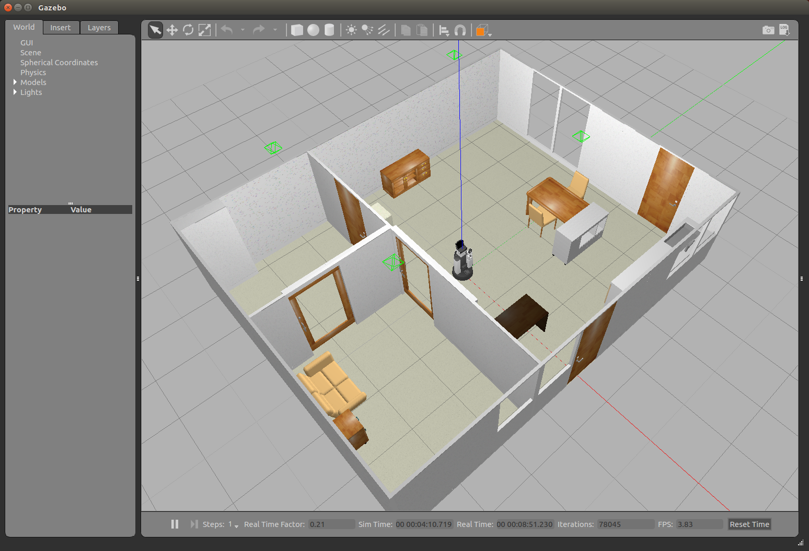
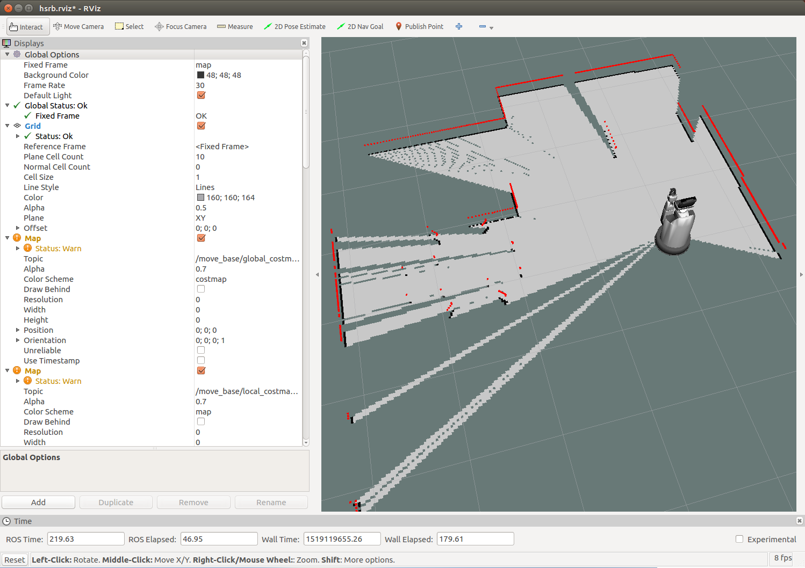
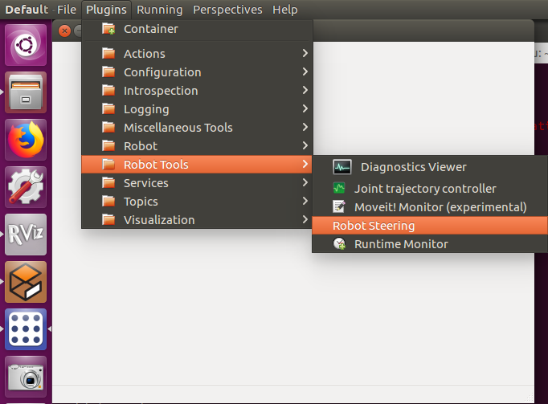
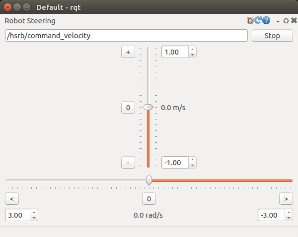
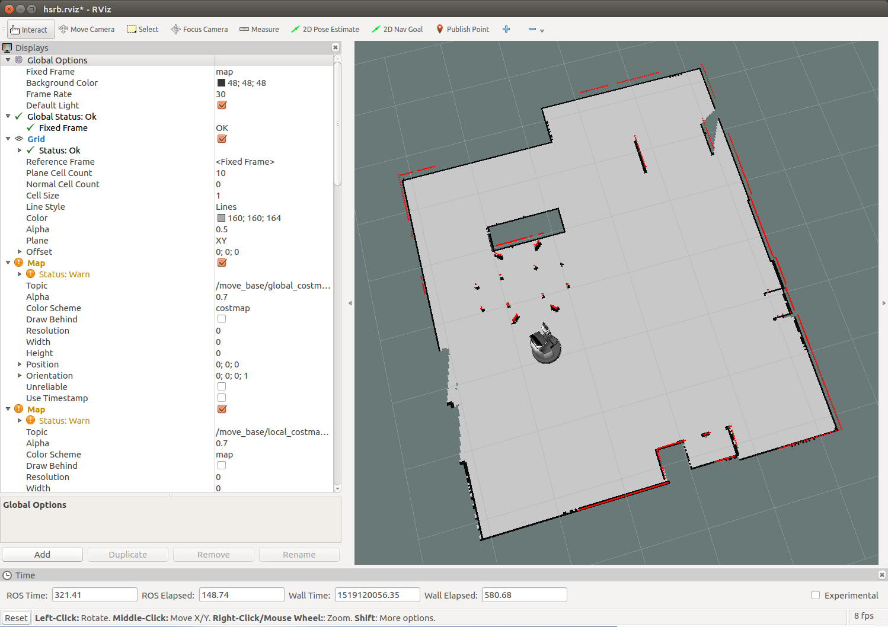

# 地図の作成

HSR の ROS の地図作成パッケージ hsrb_mapping を利用して環境空間の地図を作成します．


## ソフトウェアの起動

### シミュレータの場合

HSR の Gazebo シミュレータと RViz を起動します．

**ターミナル-1**

```
$ roslaunch hsrb_rosnav_config simple_gazebo_world.launch gui:=true rviz:=true
```



Gazebo は初回起動時はエラーを出したりモデルが表示されないことがあります．
その場合は一度 Gazebo を終了して再度ソフトウェアを起動するなどしてください．

- 【参考】[Gazebo に関するトラブルシューティング](hsrb_ros-tutorial_ja_trouble-shooting.md#gazebo-trouble-shooting)
    - [hsrb_ros-tutorial_ja_trouble-shooting.md#gazebo-trouble-shooting](hsrb_ros-tutorial_ja_trouble-shooting.md#gazebo-trouble-shooting)


別のターミナルから地図生成プログラムを起動します．

**ターミナル-2**

```
$ roslaunch hsrb_mapping hector.launch
```

地図生成プログラムを起動した RViz は次のような状態になります．




- 【参考】[RViz に関するトラブルシューティング](hsrb_ros-tutorial_ja_trouble-shooting.md#rviz-trouble-shooting)
    - [hsrb_ros-tutorial_ja_trouble-shooting.md#rviz-trouble-shooting](hsrb_ros-tutorial_ja_trouble-shooting.md#rviz-trouble-shooting)


### 実機ロボットの場合

実機ロボットを ROS Master とした ROS 環境で各操作を行います．
そのために立ち上げたターミナルのそれぞれで最初に `hsrb_mode` と入力して
ROS 環境の変更を行ってください．

- **メモ-1** : `hsrb_mode` では ROS Master を実機ロボットに変更しています．
- **メモ-2** : シミュレーション環境に戻すには `exit` か `sim_mode` を実行してください．

また，実機ロボット内で実行されている ROSノード `/pose_integrator` が
これから行う地図作成処理内のノードと重複するので
`/pose_integrator` を下記コマンドで終了しておく必要があります．

**ターミナル-1**

```
$ hsrb_mode
$ rosnode kill /pose_integrator
```

RViz がまだ起動されていないので上記と同じターミナルでよいので
下記コマンドにより起動します．

```
$ rviz -d $(rospack find hsrb_rosnav_config)/launch/hsrb.rviz
```

これでシミュレーションの場合の Gazebo シミュレータが実機ロボットと実環境に置き換わり，
それを RViz でモニターしている状態になります．

あとはシミュレーションの場合と同じように
別のターミナルから地図生成プログラムを起動します．
ただし `hsrb_mode` で ROS Master を実機ロボットにしておくのを忘れないようにしてください．

**ターミナル-2**

```
$ hsrb_mode
$ roslaunch hsrb_mapping hector.launch
```


## 地図の生成

地図はロボットを環境内で移動させながら生成します．
HSR のベース部にあるレーザセンサで空間の障害物を検知して，
その情報から地図を構成・生成します．

ロボットの移動操作を行うにはいくつかの方法があります．

- RQT Robot Steering で移動操作をする
- ジョイスティックゲームパッドで移動操作をする
- キーボードで移動操作をする

ロボットを環境空間内で移動させて地図を完成させてください．

- **注意-1** : 実機ロボットの場合には各ターミナル起動時に `hsrb_mode` を実行してください．
- **注意-2** : 実機ロボットの場合には動作環境・状況をよく確認しながら実行してください．

### RQT Robot Steering による移動操作

RQT Robot Steering を利用してロボットを操作します．
まず rqt を起動します．

**ターミナル-3**

```
$ rqt
```

次に rqt のメニューバーにある Plugins から
**Robot Tools** > **Robot Steering** を選択します．



テキストボックス内に移動速度指令のトピック `/hsrb/command_velocity` を設定します．



ロボットの移動操作をします．

- 上下方向のスライダ : 前後方向の速度指令
- 左右方向のスライダ : 回転方向の角速度指令

ロボットが移動するとレーザセンサが届く範囲が変化して次第に地図が拡大してゆきます．
ロボットを環境空間内で適宜移動させて地図を完成させます．




### ジョイスティックゲームコントローラによる移動操作

ジョイスティック付きのゲームコントローラを Ubuntu PC に接続します．

hsrb_mapping パッケージで用意している teleop_joy.launch を利用します．
Xbox 360 互換（ XInput 対応 ）のジョイスティックコントローラに対応しています．

**ターミナル-3**
```
$ roslaunch hsrb_mapping teleop_joy.launch
```

ジョイスティックの操作方法は次のようになっています．

- 左ショルダーボタン（L1）を押しながら
	- 左スティック / 上下 : 前後方向の速度指令
	- 左スティック / 左右 : 左右方向の速度指令
	- 右スティック / 左右 : 回転方向の角速度指令

ジョイスティックでロボットを環境空間内で移動させてみてください．

- 【参考】[ジョイスティックコントローラに関するトラブルシューティング](hsrb_ros-tutorial_ja_trouble-shooting.md#joystick-trouble-shooting)
    - [hsrb_ros-tutorial_ja_trouble-shooting.md#joystick-trouble-shooting](hsrb_ros-tutorial_ja_trouble-shooting.md#joystick-trouble-shooting)


### キーボードによる移動操作

キーボードで移動速度指令値を設定できます．
hsrb_mapping パッケージで用意している teleop_keyboard.launch を利用します．

キーボード操作に必要なパッケージがインストールされていない場合は
次のコマンドでインストールします．

```
$ sudo apt-get install ros-kinetic-teleop-twist-keyboard
```

ターミナルで teleop_keyboard.launch を起動します．

**ターミナル-3**

```
$ roslaunch hsrb_mapping teleop_keyboard.launch
```

ターミナルに次のような画面が表示されます．

```
:
:
Reading from the keyboard  and Publishing to Twist!
---------------------------
Moving around:
   u    i    o
   j    k    l
   m    ,    .

For Holonomic mode (strafing), hold down the shift key:
---------------------------
   U    I    O
   J    K    L
   M    <    >

t : up (+z)
b : down (-z)

anything else : stop

q/z : increase/decrease max speeds by 10%
w/x : increase/decrease only linear speed by 10%
e/c : increase/decrease only angular speed by 10%

CTRL-C to quit

currently:	speed 0.5	turn 1
```

キーボードによる主な移動操作は次のようになっています．
速度指令を送り続けるにはキーを押し続ける必要があり，
キーを離すと速度指令値が 0 に戻ります．

- `i` : 前進
- `,` : 後進
- `j` : 左旋回
- `l` : 右旋回
- `J` : 左並進（ 大文字の `J` / Shiftキーを押しながら ）
- `L` : 右並進（ 大文字の `L` / Shiftキーを押しながら ）
- `q` : 速度指令値 10% 増加
- `z` : 速度指令値 10% 減少

RViz の画面を見ながらキーボードでロボットを動かしてみてください．
キー入力の際はターミナルにフォーカスがある必要があります．


## 地図の保存

ロボットを移動して完成させた地図を保存するために下記コマンドを実行します．

**ターミナル-4**
```
$ rosrun map_server map_saver
```

- **注意** : `map_server` と `map_saver` はそれぞれ異なるものであり、間違えやすいので注意して下さい．

実行結果

```
$ rosrun map_server map_saver
[ INFO] [1514984244.267861644]: Waiting for the map
[ INFO] [1514984244.487766203]: Received a 192 X 192 map @ 0.050 m/pix
[ INFO] [1514984244.492864163]: Writing map occupancy data to map.pgm
[ INFO] [1514984244.503525258]: Writing map occupancy data to map.yaml
[ INFO] [1514984244.509132104]: Done
```

これでカレントディレクトリに下記の2つのファイルが保存されます．

- map.pgm
- map.yaml

map.pgm は通常の画像ファイルですので，
GIMP などの一般的な画像編集ソフトで修正することが可能です．

これらのファイルは次章の「ナビゲーション - 自律移動」で用いるので
ROS から指定しやすい場所に移動しておきます．

```
$ mv map.pgm map.yaml ~/.ros/
```


## ソフトウェアの終了

地図が書き出されたことを確認したら地図生成で使用したプログラムを終了します．
プログラムを起動したそれぞれのターミナルで Ctrl-C を入力して停止します．

- 終了するプログラム
  - 地図生成プログラム : hector.launch
  - ロボット移動操作で使用したプログラム
    - RQT Robot Steering : rqt
    - ジョイスティックプログラム teleop_joy.launch
    - キーボード操作プログラム teleop_keyboard.launch

Gazebo と RViz は次章「ナビゲーション」でも使用しますので実行したままで構いません．
一旦終了したい場合は他のプログラムと同様に起動したターミナルで Ctrl-C の入力で
Gazebo と RViz の全てのノードが停止します．


<!-- EOF -->
