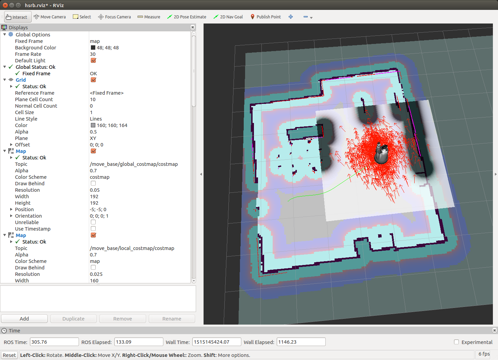
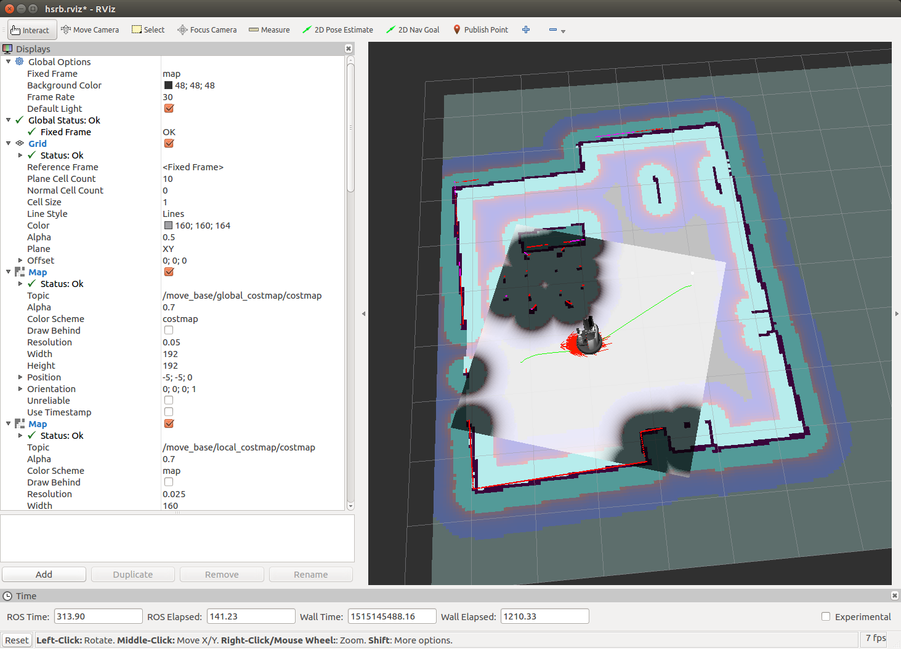
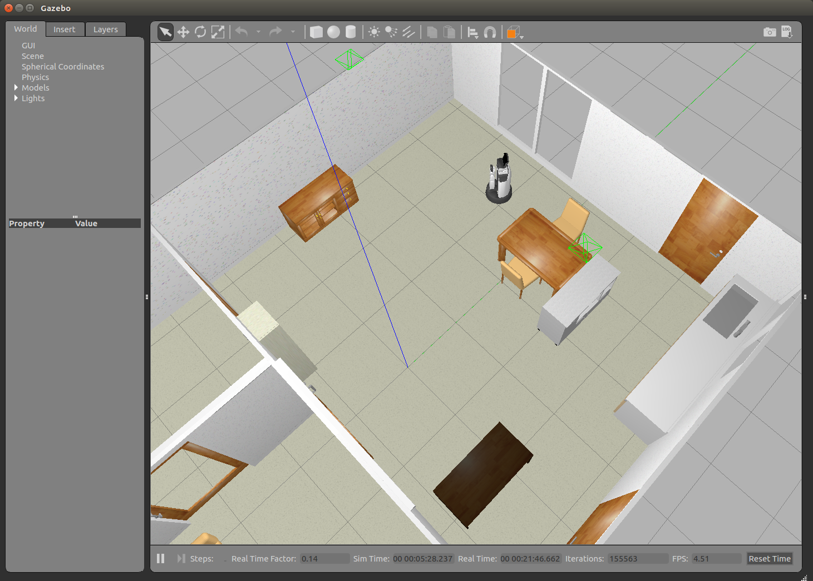
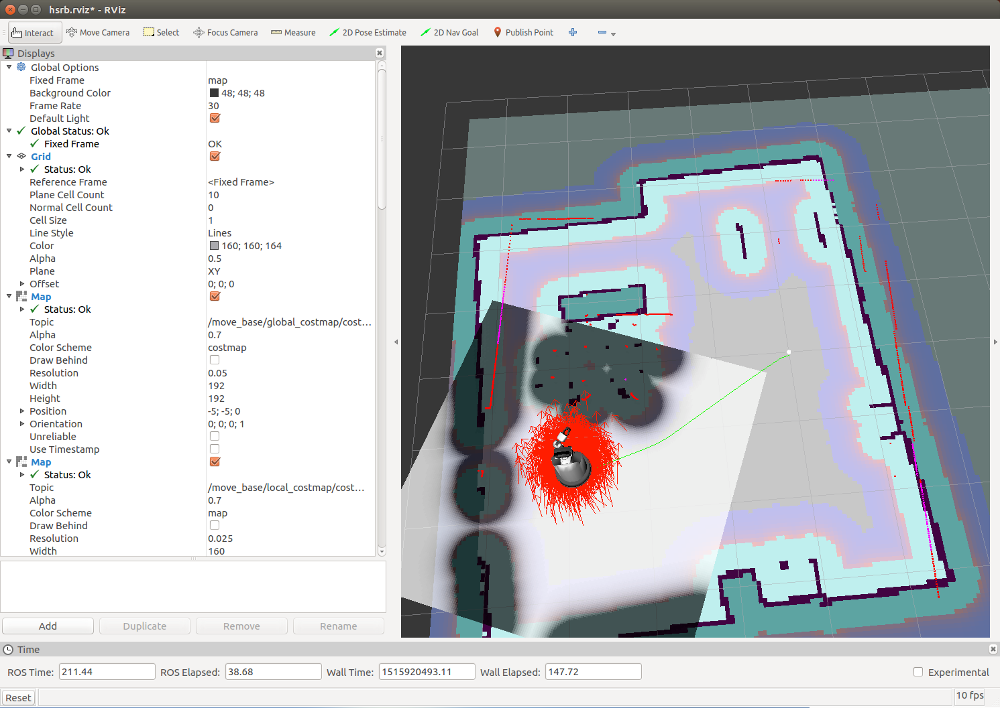
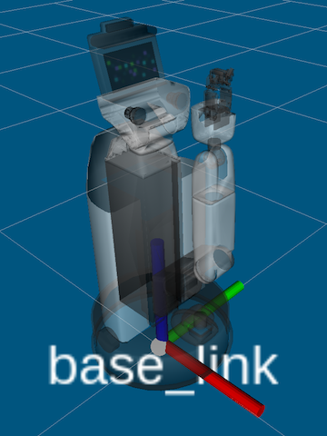
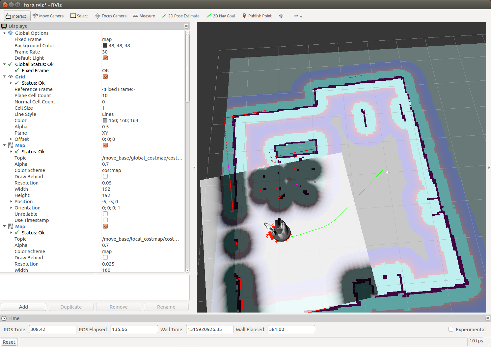
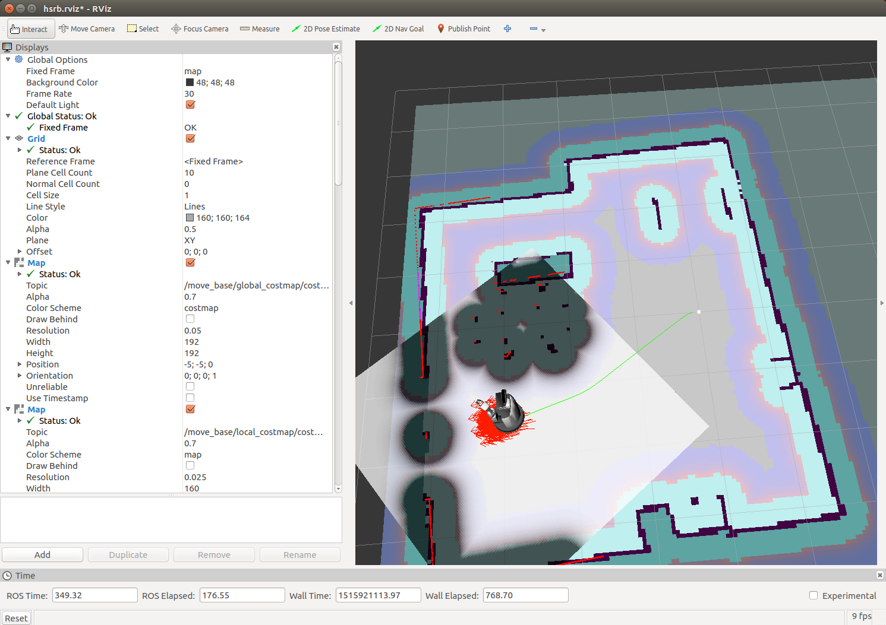

# 自律移動 - ナビゲーション

HSR の ROS の自律移動パッケージ hsrb\_rosnav\_conf を利用して
環境空間内の自律移動を行います．


## ソフトウェアの起動

### シミュレータの場合

HSR の Gazebo シミュレータと RViz を起動します．
「地図の作成」から起動したままの場合は再び起動する必要はありません．

**ターミナル-1**

```
$ roslaunch hsrb_rosnav_config simple_gazebo_world.launch gui:=true rviz:=true
```

- **メモ** : オプション `gui:=true` は Gazebo シミュレータの GUI を表示する設定です．グラフィック処理が重いような場合には  `gui:=false`（こちらがデフォルトなので "指定なし" でも可）としてシミュレータの GUI だけをオフにすることもできます．

自律移動プログラムを実行します．
hsrb\_rosnav\_conf パッケージで用意されているサンプルの地図を利用する場合は
次のコマンドを実行します．

**ターミナル-2**

```
$ roslaunch hsrb_rosnav_config hsrb_nav.launch
```

前章「地図の作成」で保存して `~/.ros/` に移動させた地図を利用する場合は
`map_file` オプションに `map.yaml` を指定して実行します．

```
$ roslaunch hsrb_rosnav_config hsrb_nav.launch map_file:=map.yaml
```


### 実機ロボットの場合

ターミナルの ROS 環境を `hsrb_mode` にしてノード `/pose_integrator` を停止します．
前章「地図の作成」で既に `/pose_integrator` を停止している場合は
再び停止操作をおこなう必要ありません．

**ターミナル-1**

```
$ hsrb_mode
$ rosnode kill /pose_integrator
```

RViz を起動します．
「地図の作成」から起動したままの場合は再び起動する必要はありません．

```
$ rviz -d $(rospack find hsrb_rosnav_config)/launch/hsrb.rviz
```

あとはシミュレーションの場合と同じように自律移動プログラムを実行します．
前章「地図の作成」で保存した実環境の地図を利用しますので
`map_file` オプションに `map.yaml` を指定して実行します．

**ターミナル-2**

```
$ roslaunch hsrb_rosnav_config hsrb_nav.launch map_file:=map.yaml
```


## ロボットの初期位置の設定

ロボットは起動時に地図のどこに居るのかを知りません．
RViz を使って地図上でのロボットの初期位置と初期姿勢を与えます．

1. RViz 上部にある **2D Pose Estimate** をクリック
2. RViz のロボット空間内で目標位置でクリックしてそのままドラッグして方向を指定

RViz 上のロボットの位置と姿勢が指定した地点に設定されます．

ロボットが地図上の真の位置になると，
地図上の壁とレーザセンサ検出点群の形状が一致するようになります．
慣れるまでは何度か初期位置を与えて真の位置と姿勢に近くなるようにする必要があるでしょう．
数度の傾きや 1[m] 程度のずれであれば自己位置推定（ローカライゼーション）を
繰り返していくうちに修正されるので，それほどぴったりと一致させる必要はありません．


## RViz での自律移動操作

RViz のインタフェースからロボットの自律移動操作を行います．

RViz でロボットが自律移動する目標位置と方向を指定します．

1. RViz 上部にある **2D Nav Goal** をクリック
2. RViz のロボット空間内で目標位置でクリックしてそのままドラッグして方向を指定


ロボットの目標の位置・方向が指定されると
コストマップに従って「コスト」が最小となる経路が計画され自律移動を開始します．
コストマップは障害物に近いほどコストが高く，
遠ざかるほどコストが低くなります．



移動とともにセンサ情報に基くローカルコストマップが更新されて経路が適宜修正されます．

この画像の動作例では大幅な修正はされていませんが
保存ファイルから読み込んだ地図にない追加的な障害物がレーザセンサで検出された場合には
ローカルコストマップに反映されてそれを避ける経路が再計画されます．



目標の位置・方向に到達して自律移動が終了します．


自律移動を終了した段階での Gazebo の様子です．



地図上のいろいろな場所を目的地としてロボットを動かしてみてください．
経路上や目的地に障害物がある場合はプランニングに失敗しますが，
それ以外の場合は目的地までロボットが到達するはずです．


## プログラムからの自律移動操作

プログラムからロボットの自律移動操作を行います．
プログラムでの自律移動操作方法は主に2通りあります．

- メッセージを使った方法
- actionlib を使った方法

実機ロボットを動作させる場合は下記項目を注意しながら実行してください．

- **注意-1** : 実機ロボットの場合には各ターミナル起動時に `hsrb_mode` を実行してください．
- **注意-2** : 実機ロボットの場合には動作環境・状況をよく確認しながら実行してください．


### メッセージを使った方法

メッセージを使った方法はシンプルに利用することができます．


#### メッセージの確認

自律移動の目標の位置と方向を受け取るトピックは `move_base_simple/goal` です．
メッセージの型は `geometry_msgs/PoseStamped` です．

まずはトピックメッセージを `echo` して表示しながら
前項目と同じ手順で RViz からマウスで目的地を指定して動作を確認してみます．

実機ロボットもしくは Gazebo と RViz およびナビゲーションのプログラムが実行されている状態で
下記コマンドを実行してトピックを表示します．

```
$ rostopic echo move_base_simple/goal
```

最初はまだトピックが発行されていないので `WARNING` が出ますが，
この時点では問題ありません．

```
$ rostopic echo move_base_simple/goal
WARNING: no messages received and simulated time is active.
Is /clock being published?
```

RViz の "2D Nav Goal" でロボットの目標位置・方向を指示すると
下記の `header:` 以下のトピックが発行され `echo` を実行しているターミナルに表示されます．

```
$ rostopic echo move_base_simple/goal
WARNING: no messages received and simulated time is active.
Is /clock being published?
header:
  seq: 0
  stamp:
    secs: 280
    nsecs: 239000000
  frame_id: "map"
pose:
  position:
    x: -1.5407705307
    y: 3.07256913185
    z: 0.0
  orientation:
    x: 0.0
    y: 0.0
    z: 0.915301702633
    w: -0.402768907882
---
```

メッセージで地図上の位置（ position ）と姿勢（ orientation ）が
与えられていることがわかります．
プログラムからこのトピックにメッセージを発行することで目的地を設定することができます．


#### メッセージを使ったプログラム例

自律移動の目標位置のメッセージを送るプログラム例 `send_goal_message.py` を見てみます．

自律移動に関して行っていることは主に下記の内容です．

- 発行するトピック `/move_base_simple/goal` の設定
- 目標位置と姿勢の指定 : 地図上の位置座標 `x=-1.5`, `y=3.0`, `yaw=0.0` (yawはquaternion表現)
- 目的地のトピックの発行

**send_goal_message.py**

```python
#!/usr/bin/env python

import rospy
from geometry_msgs.msg import PoseStamped

if __name__ == '__main__':

    rospy.init_node( 'send_goal_message', anonymous=True )
    pub = rospy.Publisher( '/move_base_simple/goal', PoseStamped, queue_size=1 )

    # wait for /clock for simulation
    rospy.sleep(1)

    msg = PoseStamped()
    msg.header.stamp = rospy.Time.now()
    msg.header.frame_id = "map"
    msg.pose.position.x = -1.5
    msg.pose.position.y = 3.0
    msg.pose.orientation.w = 1.0

    print( msg )
    pub.publish( msg )

```

サンプルプログラムを実行してみます．

```
$ rosrun nsrb_navigation send_goal_message.py
```

地図上の位置座標 `x=-1.5`, `y=3.0` に移動したことと思います．




### 姿勢の指定 - クォータニオン

ROS では回転の表現に Quaternion（四元数）が利用されます．
Quaternion は直感的ではありませんが，
その算出には **オイラー角-クォータニオン変換ツール** が利用できます．

クォータニオン変換ツールの Python コンソールでの使用例

```python
$ python
>>> import math
>>> from tf import transformations
>>> transformations.quaternion_from_euler(0,0,0)
array([ 0.,  0.,  0.,  1.])
>>> transformations.quaternion_from_euler(0,0,math.pi/2)
array([ 0.        ,  0.        ,  0.70710678,  0.70710678])
```

HSR のロボット基準座標系は下のようになっています．
水平な床面を移動する限りはベース部の回転は Z軸（ Yaw ）回りのみになります．

 軸 | 正 | 負 | RViz 表示
--:|:---:|:---:|:--
 X | 前 | 後 | 赤 Red
 Y | 左 | 右 | 緑 Green
 Z | 上 | 下 | 青 Blue




クォータニオン変換を使ったプログラム例 send_goal_message_rotate.py を下に記します．

**send_goal_message_rotate.py**

```python
#!/usr/bin/env python

import rospy
from geometry_msgs.msg import PoseStamped

import math
from tf import transformations

if __name__ == '__main__':

    rospy.init_node( 'send_goal_message', anonymous=True )
    pub = rospy.Publisher( '/move_base_simple/goal', PoseStamped, queue_size=1 )

    # wait for /clock for simulation
    rospy.sleep(1)

    msg = PoseStamped()
    msg.header.stamp = rospy.Time.now()
    msg.header.frame_id = "map"
    msg.pose.position.x = -1.5
    msg.pose.position.y = 3.0

    q = transformations.quaternion_from_euler( 0.0, 0.0, math.pi/2 )
    msg.pose.orientation.x = q[0]
    msg.pose.orientation.y = q[1]
    msg.pose.orientation.z = q[2]
    msg.pose.orientation.w = q[3]

    print( msg )
    pub.publish( msg )

```

クォータニオン変換を使ったプログラム例 send_goal_message_rotate.py を実行します．

```
$ rosrun hsrb_rosnav_config send_goal_message_rotate.py
```




### actionlib を使った方法

`/move_base_simple/goal` トピックを使う方法はシンプルですが，
自律移動を途中でキャンセルすることや
ロボットが目的地に辿り着いたかどうかを知ることができません．

そのため，より高度な自律移動の目的地の指定方法として
**actionlib** という仕組みの方がよく使われます．

下に actionlib を利用したプログラム例を記します．

**send_goal_action.py**

```python
#!/usr/bin/env python

import rospy, actionlib
from move_base_msgs.msg import *

if __name__ == '__main__':

    try:
        rospy.init_node( 'send_goal', anonymous=True )
        client = actionlib.SimpleActionClient( 'move_base', MoveBaseAction )
        client.wait_for_server()

        goal = MoveBaseGoal()
        goal.target_pose.header.stamp = rospy.Time.now()
        goal.target_pose.header.frame_id = "/map"
        goal.target_pose.pose.position.x = -1.5
        goal.target_pose.pose.position.y = 3.0
        goal.target_pose.pose.orientation.w = 1.0

        print( goal )
        client.send_goal( goal )

        finished = client.wait_for_result()
        print( "Finished : {}".format( finished ) )

    except rospy.ROSInterruptException:
        pass
```

プログラムの各部分について説明します．

ROS ノードと actionlib の SimpleActionClient の初期化をします．

```python
rospy.init_node( 'send_goal', anonymous=True )
client = actionlib.SimpleActionClient( 'move_base', MoveBaseAction )
client.wait_for_server()
```

目的地の座標を設定して actionlib クライアントから actionlib サーバへ送ります．

```python
goal = MoveBaseGoal()
goal.target_pose.header.stamp = rospy.Time.now()
goal.target_pose.header.frame_id = "/map"
goal.target_pose.pose.position.x = -1.5
goal.target_pose.pose.position.y = 3.0
goal.target_pose.pose.orientation.w = 1.0

print( goal )
client.send_goal( goal )
```

動作の終了を待ち，
終了したらその結果を受け取って表示します．

```python
finished = client.wait_for_result()
print( "Finished : {}".format( finished ) )
```

actionlib を使用したプログラム例を実行します．

```
$ rosrun hsrb_rosnav_config send_goal_action.py
```




## ソフトウェアの終了

プログラムを起動したそれぞれのターミナルで Ctrl-C を入力して停止します．


<!-- EOF -->
