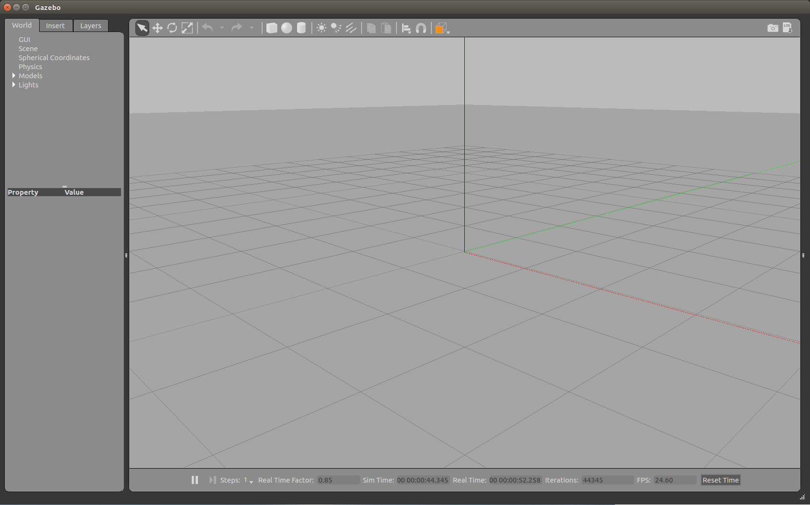
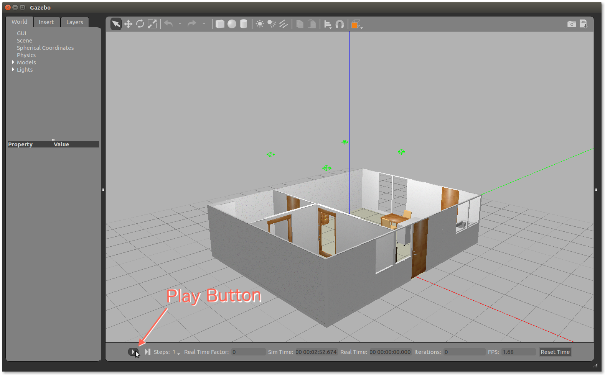
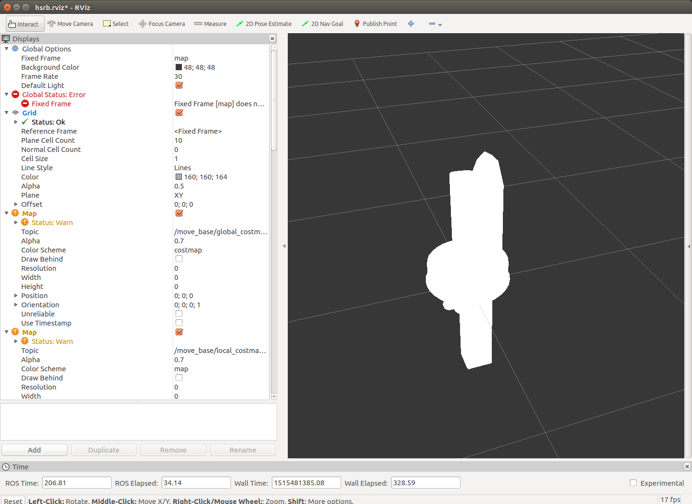

# トラブルシューティング

### ROS 環境の確認

ROS の環境が正しく設定されているかや、
今どのワークスペースを使用しているのか分からなくなる場合があります．

その場合はまず `roscd` コマンドを用いてみてください．
`roscd` は指定したパッケージのワークスペース内のディレクトリに移動するコマンドですが
引数なしで実行されるとワークスペースのトップに移動します．

```
$ roscd
$ pwd
/home/<username>/catkin_ws/devel
```

となれば `~/catkin_ws` がワークスペースとして設定されています．

```
$ roscd
$ pwd
/opt/ros/\RosDistro
```

となれば ROS のシステムは設定されていますがワークスペースは設定されていません．

```
$ roscd
roscd: コマンドが見つかりません
```

となれば ROS のシステム自体が設定されていません．
どちらの場合も，ワークスペースの設定ファイル `~/catkin_ws/devel/setup.bash` を
実行することで ROS システムと環境の設定を行ってください．

また，`env` を実行することでも ROS の環境変数を確認することができます．

```
$ env | grep ROS
```

下記実行例は開発用 PC 内でシミュレータを使うときの環境設定です．
実機ロボットを使用するような環境設定の場合には`ROS_MASTER_URI` などが変わってきます．

```
$ env | grep ROS
ROS_ROOT=/opt/ros/kinetic/share/ros
ROS_PACKAGE_PATH=/home/robotuser/catkin_ws/src:/opt/ros/kinetic/share
ROS_MASTER_URI=http://localhost:11311
ROSLISP_PACKAGE_DIRECTORIES=/home/robotuser/catkin_ws/devel/share/common-lisp
ROS_DISTRO=kinetic
ROS_IP=192.168.64.6
ROS_HOME=/home/robotuser/.ros
ROS_ETC_DIR=/opt/ros/kinetic/etc/ros
```

- 主な確認事項
  - `ROS_DISTRO` : ROS のバージョンは正しいか？
  - `ROS_PACKAGE_PATH` : ROS のパッケージパスが適切か？
  - `ROS_MASTER_URI` : ROS Master の URI 設定が正しいマスターを示しているか？

`env | grep GAZEBO` とすると Gazebo のモデルのファイルパスを確認できます．

```
$ env | grep GAZEBO
GAZEBO_MODEL_PATH=/opt/ros/kinetic/share/tmc_gazebo_worlds/models:/opt/ros/kinetic/share/tmc_gazebo_worlds/models:/opt/ros/kinetic/share/tmc_gazebo_worlds/models:/opt/ros/kinetic/share/tmc_gazebo_worlds/models
```

## Gazebo に関するトラブルシューティング

### Gazebo 起動時に3Dモデルが表示されない

ソフトウェアインストール直後や Ubuntu 起動直後に
Gazebo を起動すると3Dモデルが表示されずに
3Dモデル表示部が黒いままになることがあります．

#### 【対策-1】数分待つ

一般的にも初回起動時に Gazebo がモデルを読み込むのに時間がかかることがあり，
数分待つことで解決することもあります．

#### 【対策-2】Gazebo を再起動する

Gazebo は時々3Dモデルの表示に失敗することがあります．
一度全ての ROS ノードを終了して Gazebo を再実行すると表示されるようになることがあります．

#### 【対策-3】rostest を実行してみる

シミュレーションの起動ではなく下記の rostest を実行することで
Gazebo に HSR ロボットや環境モデルが表示されるようになることもあります．

```
$ rostest hsrb_mapping hsrb_mapping.test gui:=true rviz:=true
```

もしくは

```
$ rostest hsrb_rosnav_config hsrb_navigation.test gui:=true rviz:=true
```

#### 【対策-4】Gazebo だけを実行してみる

Gazebo の最小構成で実行できるのかを確認します．

```
$ roslaunch gazebo_ros empty_world.launch
```



このようなグリッドが表示されない場合にはコンピュータのスペック不足が考えられます．
仮想コンピュータの場合は、設定の調整や実コンピュータ上での実行の検討を行ってください．


### Gazebo から TF が発行されていない

#### 【対策-1】Gazebo の再生ボタンを押す

HSR の Gazebo シミュレータで
`hsrb_gazebo_launch` の `hsrb_mock_home_world.launch` を起動した場合は
デフォルト起動状態では Gazebo シミュレータが走っていない状態となっています．

```
roslaunch hsrb_gazebo_launch hsrb_mock_home_world.launch
```

Gazebo の左下にある Play ボタンを押してシミュレーションを開始します．




## RViz に関するトラブルシューティング

### RViz 上のロボットの全体が白く表示される

RViz 上のロボット全体が白く表示されてしまっている状態は
Fixed Frame が `/map` になっているが
`/map` が発行されていないというケースが考えられます．



#### 【対策-1】`/map` を発行するノードを実行する

`/map` を発行するプログラムを実行してください．

地図を作成するときは次のコマンドを実行します．

```
roslaunch hsrb_mapping gmapping.launch
```

自律移動をするときは次のコマンドを実行します．

```
roslaunch hsrb_rosnav_config hsrb_nav.launch
```

#### 【対策-2】`/map` を使用しない場合は Fixed Frame を変更する

本チュートリアルでは基本的に `/map` を使用しますが，
それ以外のときに `/map` を使用しない，発行しないような場合には
"Fixed Frame" を `/base_link` などに変更してください．


## ジョイスティックコントローラに関するトラブルシューティング

### ジョイスティックからロボットの移動操作ができない

#### 【対策-1】Enable ボタンを押しながらジョイスティックを動かす

ジョイスティックコントローラからロボットに速度指令を送るには
Enable ボタンを押しながらジョイスティックを動かす必要があります．

Xbox 360 互換（XInput）の場合は L1 ボタン（ボタン番号8番）が Enable ボタンです．

#### 【対策-2】ジョイスティックの設定・動作状況を確認する

ジョイスティックがデバイスとして認識されているかを確認します．
通常であれば `ls /dev/input/` の結果に `js0` があります．

```
$ ls /dev/input/
by-id  by-path  event0  event1  event2  event3  event4  js0  mice  mouse0
```

ジョイスティックがデバイスとして認識されているようでしたら動作確認を行います．

**ターミナル-1**

```
$ roscore
```

**ターミナル-2**

```
$ roslaunch hsrb_mapping teleop_joy.launch
```

**ターミナル-3**

```
$ rostopic list
/diagnostics
/hsrb/command_velocity
/joy
/rosout
/rosout_agg
```

`/joy` トピックがあるはずですので `echo` で動作状況を確認します．

ジョイスティックを動かすと `axes:` の数値が変化します．

ボタンを押すと `buttons:` の数値が変化します．
特に 10番 のボタン（ 配列で最初が0番なので左から11番目の数値 ）
が `1` になることを確認してください．

```
$ rostopic echo /joy
header: 
  seq: 2136
  stamp: 
    secs: 0
    nsecs:         0
  frame_id: ''
axes: [-0.0, -0.0, 0.0, 0.0, 0.0, 0.0, 0.0, 0.0, 0.0, 0.0, 0.0, 0.0, 0.0, 0.0, 1.0, 0.0, 0.0, 0.0, 0.0, 0.0, 0.0, 0.0, 0.0, -0.0, -0.0, 0.09228315204381943, 0.0]
buttons: [0, 0, 0, 0, 0, 0, 0, 0, 0, 0, 0, 0, 0, 0, 0, 0, 0, 0, 0]

---
:
:

:
:
header: 
  seq: 2137
  stamp: 
    secs: 0
    nsecs:         0
  frame_id: ''
axes: [-0.0, -0.0, 0.0, 0.0, 0.0, 0.0, 0.0, 0.0, 0.0, 0.0, 0.0, 0.0, 0.0, 0.0, 1.0, 0.0, 0.0, 0.0, 0.0, 0.0, 0.0, 0.0, 0.0, -0.0, -0.0, 0.08955255150794983, 0.0]
buttons: [0, 0, 0, 0, 0, 0, 0, 0, 0, 0, 0, 0, 0, 0, 0, 0, 0, 0, 0]
---
:
:

:
:
header: 
  seq: 2138
  stamp: 
    secs: 0
    nsecs:         0
  frame_id: ''
axes: [-0.0, -0.0, 0.0, 0.0, 0.0, 0.0, 0.0, 0.0, 0.0, 0.0, 0.0, 0.0, 0.0, 0.0, 1.0, 0.0, 0.0, 0.0, 0.0, 0.0, 0.0, 0.0, 0.0, -0.0, -0.0, 0.08955255150794983, 0.0]
buttons: [0, 0, 0, 0, 0, 0, 0, 0, 0, 0, 1, 0, 0, 0, 0, 0, 0, 0, 0]
---
:
:

```


<!-- EOF -->
