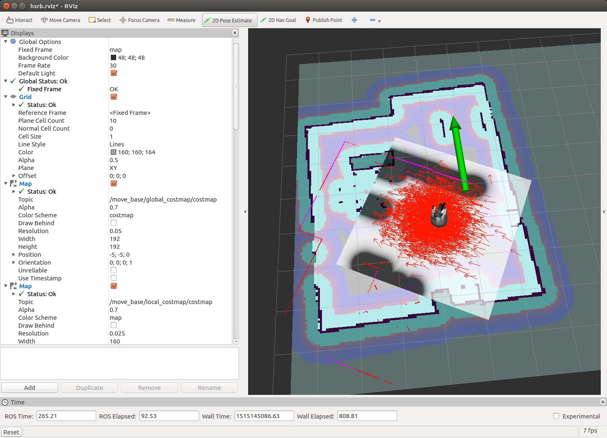
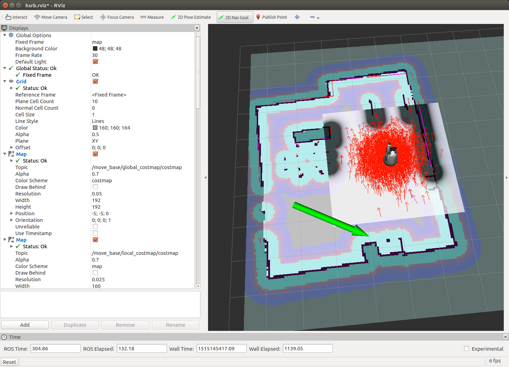
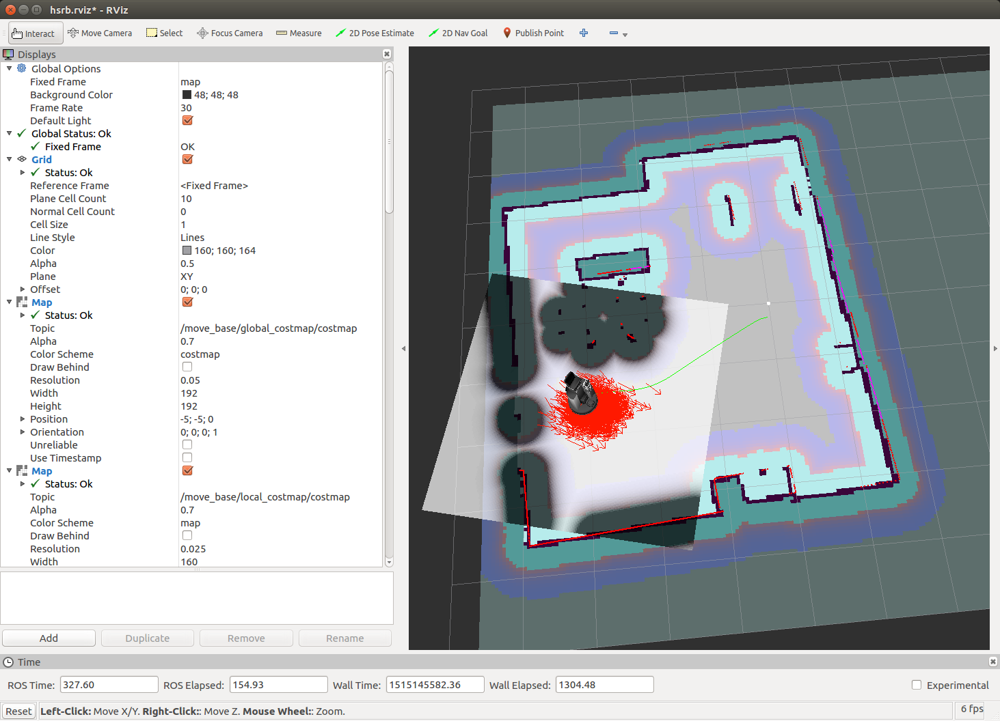

# hsrb_rosnav_config

## パッケージ概要

hsrb_rosnav_config は トヨタパートナーロボット HSR の ROS 自律移動パッケージです．
本パッケージを利用することで環境空間内の自律移動を行うことができます．

ROS Kinetic に対応しています．


## チュートリアル

URL : TBD


## クイックスタート

### ソフトウェアの起動

#### シミュレータの場合

Gazebo シミュレータと RViz を起動します．

```
$ roslaunch hsrb_rosnav_config simple_gazebo_world.launch gui:=true rviz:=true
```

#### 実機ロボットの場合

実機ロボットを使用する場合の ROS 環境に変更して，
重複するノードの停止と RViz の起動を行います．

```
$ hsrb_mode
$ rosnode kill /pose_integrator
$ rviz -d $(rospack find hsrb_rosnav_config)/launch/hsrb.rviz
```


### 自律移動プログラムの実行

下記コマンドを実行して地図作成プログラムを起動します．

- **注意** : 実機ロボットの場合には各ターミナル起動時に `hsrb_mode` を実行して ROS 環境を変更してください．

```
$ roslaunch hsrb_rosnav_config hsrb_nav.launch map_file:=map.yaml
```

### ロボットの初期位置の設定

ロボットは起動時に地図のどこに居るのかを知りません．
RViz を使って地図上でのロボットの初期位置と初期姿勢を与えます．

1. RViz 上部にある **2D Pose Estimate** をクリック
2. RViz のロボット空間内で目標位置でクリックしてそのままドラッグして方向を指定

RViz 上のロボットの位置と姿勢が指定した地点に設定されます．




### RViz での自律移動操作

RViz でロボットが自律移動する目標位置と方向を指定します．

1. RViz 上部にある **2D Nav Goal** をクリック
2. RViz のロボット空間内で目標位置でクリックしてそのままドラッグして方向を指定



目標の位置・方向に到達して自律移動が終了します．



-----

## リファレンス

### /launch

#### hsrb_nav.launch

- 起動オプション : デフォルト
  - map_file : hsrb_mapping/map/gmapping/map.yaml
	  - マップフィアルの指定
- ノード
  - /map_server
    - 入力トピック
      - なし
    - 出力トピック
      - /map
      - /map_metadata
- インクルード
  - hsrb_rosnav_config/launch/include/amcl.launch.xml
  - hsrb_rosnav_config/launch/include/move_base.launch.xml


### /launch/include

#### amcl.launch.xml

- 起動オプション : デフォルト
  - scan_topic : /hsrb/base_scan
  - map_topic : map
  - use_map_topic : false
- ノード
	- /amcl
    - 入力トピック
      - /hsrb/base_scan
      - /tf
      - /tf_static
      - /initialpose
    - 出力トピック
      - /tf
      - /particlecloud
      - /amcl_pose
      - /amcl/parameter_updates
      - /amcl/parameter_descriptions

#### move_base.launch.xml

- 起動オプション
  - map_topic : map
  - cmd_vel_topic : hsrb/command_velocity
  - odom_topic : hsrb/odom
- ノード
  - /move_base
    - 入力トピック
      - /tf
      - /tf_static
      - /hsrb/base_scan
      - /hsrb/odom
      - /hsrb/head_rgbd_sensor/depth_registered/points
      - /move_base/action_topics
      - /map
      - /move_base/goal
      - /move_base/cancel
      - /move_base_simple/goal
    - 出力トピック（Active）
      - /hsrb/command_velocity
      - /move_base/NavfnROS/plan
      - /move_base/goal
      - /move_base/status
      - /move_base/result
      - /move_base/feedback
      - /move_base/local_costmap/costmap
      - /move_base/local_costmap/costmap_updates
      - /move_base/global_costmap/costmap
      - /move_base/global_costmap/costmap_updates


### /script

#### send_goal_message.py

- 起動オプション
  - なし
- ノード
  - /send_goal
    - 入力トピック
      - なし
    - 出力トピック
      - /move_base_simple/goal
- ソース URL
  - TBD


#### send_goal_message_rotate.py

- 起動オプション
  - なし
- ノード
  - /send_goal
    - 入力トピック
      - なし
    - 出力トピック
      - /move_base_simple/goal
- ソース URL
  - TBD


#### send_goal_action.py

- 起動オプション
  - なし
- ノード
  - /send_goal
    - 入力トピック
      - /move_base/result
      - /move_base/status
      - /move_base/feedback
    - 出力トピック
      - /move_base/goal
      - /move_base/cancel
- ソース URL
  - TBD


<!-- EOF -->
